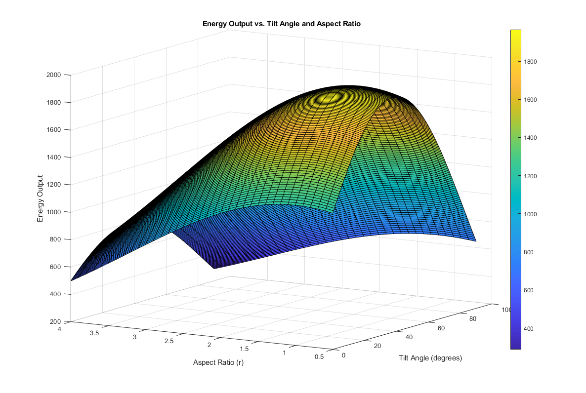

# Project Description
This project explores how to set up a solar panel for maximum energy production using MATLAB. With a fixed panel size of 2 square meters, the main goal is to calculate the perfect combination of two factors. These factors are the ideal angle to tilt the panel and its best rectangular shape.

# Project Details
Briefly describe your team's approach to the project and how you implemented your solution.

For the project, our team used MATLAB to optimize the energy output of a Solar Panel with a constant area of 2 m2. The energy function utilized was dependent on two factors, the solar panel’s tilt angle and aspect ratio (length over width). As this function is multivariable, we had to use optimization, so we decided to utilize the optimization onramp and the problem-based optimization workflow, provided by Mathworks, to become familiar with the toolboxes and their features applicable to our problem. Task one, required defining certain components, such as the area, tilt angle, aspect ratio, efficiency function due to tilt angle, sunlight intensity variation due to tilt angle, and efficiency function due to aspect ratio. Since the energy equation is dependent on two variables (tilt angle and aspect ratio) that are included in separate defined equations, we created .m files to create user-defined / helper functions to represent the individual equations. We defined the area as a variable because it is fixed. We also defined theta and r as arrays, using the built-in function of linspace of 100 values and element-wise multiplication to get the solar panel’s output of total amount of energy, which came out as an array of 100 values.  As we learned through MATLAB’s Optimization onramp, we found that we needed to download the Optimization Toolbox to obtain the results of task two. Details for optimization can be found in the section “Implementing the Optimization Function” of the LiveScript. In task three, we used the surf and meshgrid functions in MATLAB to visualize the Energy function as a 3D surface plot. More Details can be found in section “The Results” of the LiveScript.
_
# Project Solution Instructions
To run our solar panel project, first you have to install MATLAB and the Optimization Toolbox.  

Install MATLAB: [here](https://www.mathworks.com/help/install/ug/install-products-with-internet-connection.html)  

Install Optimization Toolbox: [here](https://www.mathworks.com/campaigns/products/trials/contact-info.html?prodcode=OP)  

Then you must place the main Live Script and all three helper functions (nu.m, sunIntensity.m, and f.m), into the same folder so the program can see them. Once organized, open the Live Script in MATLAB, click the Run All button at the top of the Live Editor Tab, and the code will calculate the energy formulas, use the solver to find the best setup, and draw a 3D surface graph to display the maximum energy output.

# Results
Add a picture, plot, animation, GIF, or table to demonstrate the expected result or output of your project solution.  

Optimal Tilt Angle: 37.5° from the horizontal  

Optimal Aspect Ratio: 1.00  

Maximum Energy Output: 1955.93 W  

# Reference
Add reference papers, data, or supporting materials that have been used, if any.  

[Shading impact modeling on photovoltaic panel performance - ScienceDirect](https://www.sciencedirect.com/science/article/abs/pii/S1364032125001054)  

[Solar photovoltaic output depends on orientation, tilt, and tracking - U.S. Energy Information Administration (EIA)](https://www.eia.gov/todayinenergy/detail.php?id=18871)  

[About Solar Irradiance | Earth](https://earth.gsfc.nasa.gov/climate/projects/solar-irradiance/about)  

[Panel Surface Area Maximization for Increasing PV Performance[v2] | Preprints.org](https://www.preprints.org/manuscript/202405.1294)  

[Optimization Onramp | Self-Paced Online Courses - MATLAB & Simulink](https://matlabacademy.mathworks.com/details/optimization-onramp/optim)  

[Problem-Based Optimization Workflow - MATLAB & Simulink](https://www.mathworks.com/help/optim/ug/problem-based-workflow.html)

# Contact
Provide the best e-mail at which to contact you and your team in the event that you are chosen to receive a prize.
sophiacabalfin@gmail.com
